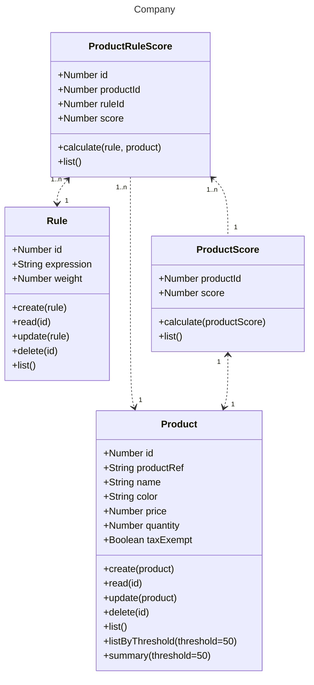
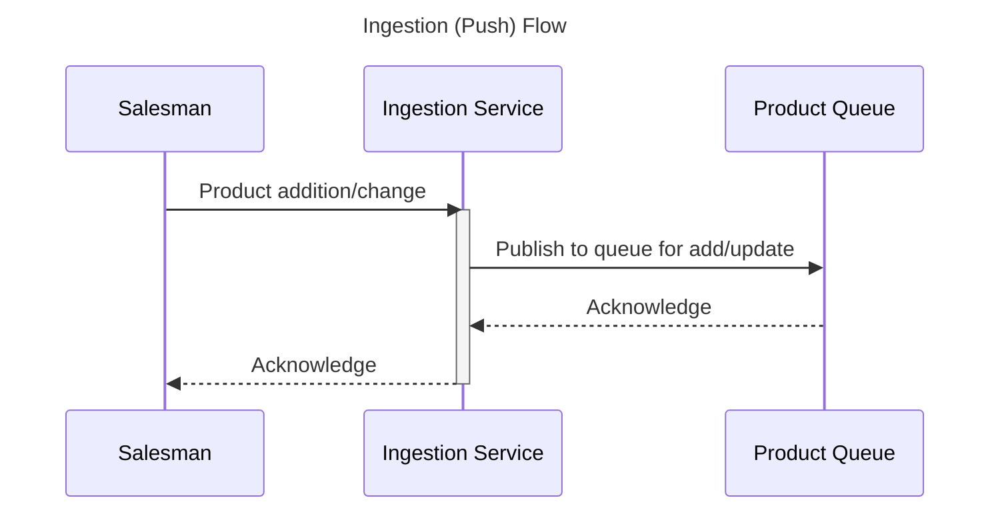
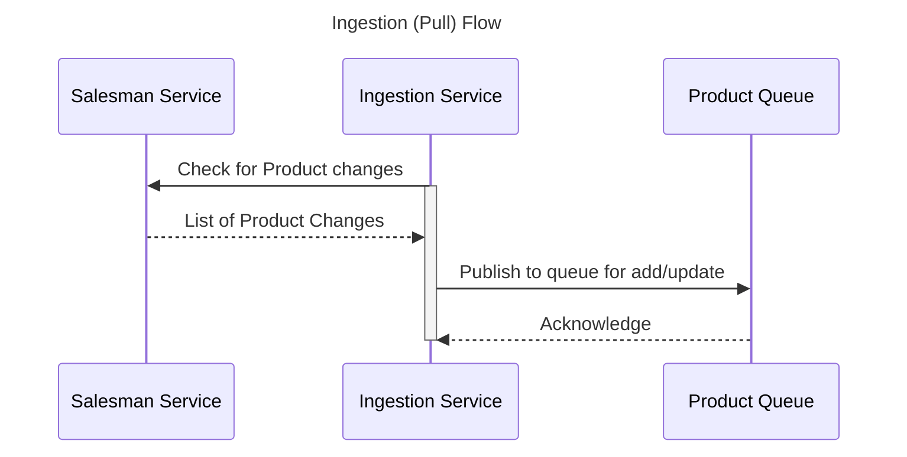
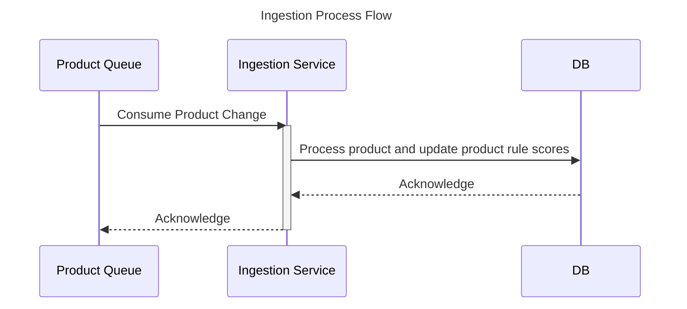

# Salesman

1. [Introduction](#introduction)
2. [Assumptions](#assumptions)
3. [Diagram](#diagram-uml)
4. [Flows](#flows)
5. [Score Calculations](#score-calculations)
6. [Performance Considerations](#performance-considerations)
7. [Usage](#usage)

## Introduction

A salesman is selling a set of products. Each product is described by a set of attributes,
such as name, type, color, cost and weight, each of which may have a different data
type (String, Boolean, Number).

A company is looking to buy products at the best possible prices, and which best match
it’s needs. It has many different products it is looking to purchase. It defines the
products it wishes to buy with a set of rules.

The company realizes that it is very time consuming and error prone to sort through the
salesman’s goods and is looking to implement a system that will:

1. Score all of the salesman’s products on how well they match their product
   definitions by calculating the sum of the rule scores, which is the percentage of
   conditions which match, multiplied by the score.
2. Filter the potential products to just those that pass a given threshold.
3. Calculate the total and average prices for all the products that score sufficiently
   highly.

## Assumptions

* String values are case-sensitive
* Number values are consistent (aka: no mix & matching currencies or imperial/metric values and all same denominations)
* Product attributes are defined up front and are static
* Only one salesman is available for the company to purchase from
* There are no Security/Sensitive Data concerns (all data/communication is trusted)
* Audit/Versioning of products' changes are not required
* Product scores are generated during ingest of Products
* Minimum set of commands are implemented (subset of what was specified in UML)
* Input to commands are pre-validated - Validation of input out of scope of POC
* Basic comparison operations are supported for rules (`like` is currently not supported)
* Rules only support and operations when specifying multiple conditions
* Summary of total cost and quantity assume all available items from the salesman

## Diagram (UML)



## Flows







## Score Calculations

During product ingestion a score is created per rule and stored. This is done assuming rules get added, removed and
updated during the life of the salesman.

When processing a specific rule for a product, each condition in the rule expression has equal weight.
For example if a product matches 2 of the 3 conditions in a rule
(`color == 'blue' && price < 17.75 && quantity > 750 -> 100`) it will get assigned 67% of the rule score
(`67` in this rule example).

When calculating overall score for a given product it will sum up the individual rule scores for that product and be 
stored on an associated product score table to keep the original product data "untouched".

When Company requests the products for purchase (based on score threshold) the backend service will rely on the database
built-in mathematical functions to calculate the totals and average prices of the qualified products based on
score threshold.

```sql
SELECT 
    COUNT(*) as uniqueProductCount,
    SUM(p.price * p.quantity) as totalCost,
    SUM(p.quantity) as totalQuantity,
    AVG(p.price) as averageCost
FROM Product as p
INNER JOIN ProductScore as s
    ON s.id = p.id
WHERE s.score >= :score
```

## Performance Considerations

* If expecting high load for data ingestion, will utilize queues (see ingestion flows above) to minimize wait times.
  **This was not implemented in the deliverable POC.**
* If on the fly calculation of totals and average prices are not performant enough, can pre-calculate the results
  based on various thresholds using internal database functionality itself.
* **Score Recalculation** is a concern here as it will need to go over every record for a given rule/condition set. We
  could further reduce this risk by storing a product passing the condition for each individual rule condition so
  recalculation is reduced to a subset of conditions instead of the entire rule and all of its associated conditions.
* Further performance improvements could be mitigated by moving to a more dynamic search based implementation using
* services like ElasticSearch

# Usage

**Pre-reqs**
* Java 17+
* Maven 3.9+

First obtain the project source code by either cloning this repository
(`git clone https://github.com/arthurvanduynhoven/salesman.git`) or by downloading the source code
(`https://github.com/arthurvanduynhoven/salesman/archive/refs/heads/main.zip`).

To start the application you can use maven by running command `mvn spring-boot:run`.

Once the spring shell started you can type `help` for available commands.

For example to get the summary view of matched products you can type `summary` which will return basic summary
information.

To list the purchasable products based on the rules and threshold you can use the command `purchases` which will
return the list of all products based on the given (`50` default) threshold.

To list the current rules you can use `rules` to get the information.

To exit the application you can use commands `exit` or `quit`.
