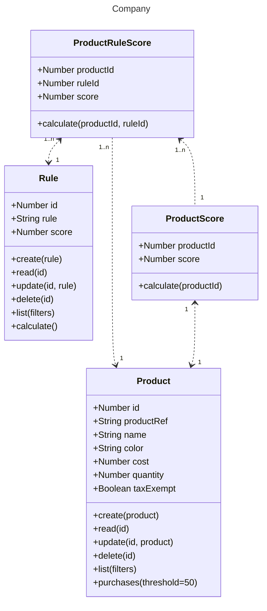
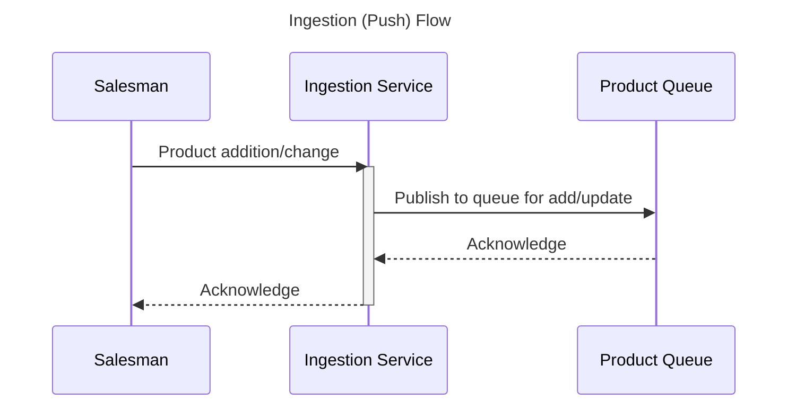
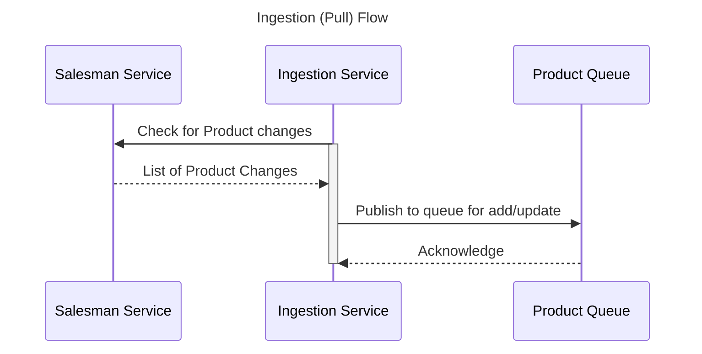
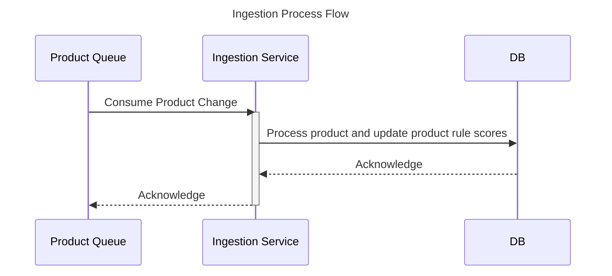

# Salesman

1. [Introduction](#introduction)
2. [Assumptions](#assumptions)
3. [Diagram](#diagram-uml)
4. [Flows](#flows)
5. [Score Calculations](#score-calculations)
6. [Performance Considerations](#performance-considerations)

## Introduction

A salesman is selling a set of products. Each product is described by a set of attributes,
such as name, type, color, cost and weight, each of which may have a different data
type (String, Boolean, Number).

A company is looking to buy products at the best possible prices, and which best match
it’s needs. It has many different products it is looking to purchase. It defines the
products it wishes to buy with a set of rules.

The company realizes that it is very time consuming and error prone to sort through the
salesman’s goods and is looking to implement a system that will:

1. Score all of the salesman’s products on how well they match their product
   definitions by calculating the sum of the rule scores, which is the percentage of
   conditions which match, multiplied by the score.
2. Filter the potential products to just those that pass a given threshold.
3. Calculate the total and average prices for all the products that score sufficiently
   highly.

## Assumptions

* String values are case-insensitive
* Number values are consistent (aka: no mix & matching currencies or imperial/metric values and all same denominations)
* Product attributes are defined up front and are static
* Only one salesman is available for the company to purchase from
    * If allowed more than one salesman, would have another table for the salesman info and an additional property on
      the Product table including the salesman identifier
* There are no Security/Sensitive Data concerns (all data/communication is trusted)
* Audit/Versioning of products' changes are not required
* Rule scores are generated during ingest of Products
    * Rule additions/changes are out of scope of this POC due to potential performance bottlenecks
* Certain environment performance considerations are ignored to simplify the POC (aka in-memory db and pre-generated
  test content)

## Diagram (UML)



```shell
class Operator
        <<enumeration>> Operator
        Operator : ==
        Operator : <
        Operator : >
        Operator : <=
        Operator : >=
        Operator : !=

class Condition
        Condition : +Number ruleId
        Condition : +String name
        Condition : +Operator operator
        Condition : +String value

    Condition "1..n" <..> "1" Rule
```
## Flows







## Score Calculations

During ingestion a score is created per rule and stored. This is done assuming rules get added, removed and updated
during the life of the salesman.

When calculating overall score for a given product it will sum up the individual rule scores and be stored on Product
table (OR on the fly?).

When Company requests the products for purchase (based on score threshold) the backend service will rely on the sql
query (Postgresql) built-in mathematical functions to calculate the totals and average prices of the qualified products.

```sql
select 1 from product where Condition.name Condition.operator Condition.value limit 1;


SELECT sum()
```


```sql
CREATE TABLE IF NOT EXISTS product (
    id serial PRIMARY KEY,
    product_ref VARCHAR(255),
    name VARCHAR(255),
    color VARCHAR(64),
    cost FLOAT,
    quantity INT,
    tax_exempt BOOLEAN,
    score FLOAT
);

CREATE TABLE IF NOT EXISTS rule (
    id serial PRIMARY KEY,
    rule TEXT,
    score FLOAT
);

CREATE TABLE IF NOT EXISTS condition (
    rule_id INT,
    name varchar(64),
    operator varchar(2),
    value varchar(255),
    FOREIGN KEY (rule_id)
        REFERENCES rule (id)
);

CREATE TABLE IF NOT EXISTS product_rule_score (
    product_id INT,
    rule_id INT,
    score FLOAT,
    FOREIGN KEY (product_id)
        REFERENCES product (id),
    FOREIGN KEY (rule_id)
        REFERENCES rule (id)
);
```

## Performance Considerations

* If expecting high load for data ingestion, will utilize queues (see ingestion flows above) to minimize wait times.
  **This was not implemented in the deliverable POC.**
* If on the fly calculation of totals and average prices are not performant enough, can pre-calculate the results
  based on various thresholds using CTE/Windows from within the database (postgresql) itself.
* **Score Recalculation** is a concern here as it will need to go over every record for a given rule/condition set. We
  could further reduce this risk by storing a product passing the condition for each individual rule condition so
  recalculation is reduced to a subset of conditions instead of the entire rule and all of its associated conditions.
